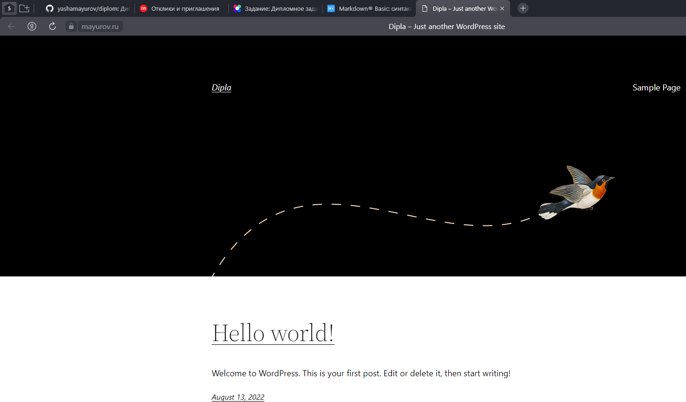
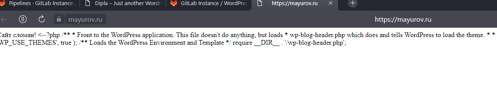

## 1. Регистрация доменного имени
В качестве доменного имени использовал ранее зарегестрированное мною доменное имя **mayurov.ru**. Для доступа к виртуальным машинам использовал статический адрес виртуальной машины proxy. Для

## 2. Создание инфраструктуры
Terraform сконфигурирован. Ресурсы собраны.
[Ссылка на код в репозитории](./terraform/)

## 3. Установка Nginx и LetsEncrypt

Для выполнения задачи разработана роль **intall-nginx-letsencrypt**, которая устанавливает nginx, утилиту letsencrypt, создает и загружает конфигурационные файлы nginx на основе jinja-шаблоны, выполняет запрос сертификата.

#### Результаты:

1. В доменной зоне настроены записи
 ```
A     @             51.250.82.247   1800
CNAME alertmanager  mayurov.ru.     1800
CNAME prometheus    mayurov.ru.     1800
CNAME grafana       mayurov.ru.     1800
CNAME gitlab        mayurov.ru.     1800
CNAME www           mayurov.ru.     1800
```
2. Upstream настроены
3. Сертификат получен. Ссылки вида htts://mayurov.ru открываются в браузере


[Ссылка на код в репозитории](./ansible/roles/intall-nginx-letsencrypt/)

## 4. Установка кластера MySQL
Для выполнения задания разработана роль **install-mysql**, выполняющая установку mysql-сервера, конфигурацию кластера и создание базы данных и пользователя, необходимые для работы cms Wordpress

#### Результаты:
1. MySQL работает в режиме репликации Master/Slave.
1. В кластере автоматически создаётся база данных c именем wordpress.
1. В кластере автоматически создаётся пользователь wordpress с полными правами на базу wordpress и паролем wordpress.
[Ссылка на код в репозитории](./ansible/roles/install-mysql/)

## 5. Установка WordPress

Для выполнения задачи разработана роль **install-wordpress**, которая выполняет следующие действия:
- Установка веб-сервера nginx
- Установка пакетов php, необходимых для работы Wordpress
- Конфигурирование Nginx для работы с php, настройку сайта Wordpress
- Скачивание дистрибутива Wordpress, распаковка файлов дистрибутива в директорию сайта
- установка gitlab-runner, необходимо для выполнения автоматического деплоя из репозитория gitlab

[Ссылка на код в репозитории](./ansible/roles/install-wordpress/)

## 6. Установка Gitlab CE и Gitlab Runner

Для выполнения реализована роли **install-gitlab-server** и **install-gitlab-runner**. Реализация данного пункта сделана двумя ролями поскольку Gitlab-runner мне представляется проще запустить на Web-сервере, на котором работает сайт Wordpress из предыдущей задачи. 

#### install-gitlab-server

В данной роли реализована установка пакетов **docker** и  **python3-docker** (последний необходим для работы ansible с docker), запуск докер контейнера из образа **gitlab/gitlab-ce:latest**

#### install-gitlab-runner

Данная роль выполняет установку gitlab-runner.

#### Выполнение деплоя при коммите в репозитории и создании тега

Для выполнения этого пункта произвёл следующие действия:
1. Создал новый проект в установленом Gitlab на основе кода репозитория Wordpress, размещенного на **github.com**
1. Зарегестрировал gitlab-runner, установленнй на Веб-сервере, на котором размещен Wordpress согласно иструкциям
1. Добавил следующий код pipeline:
```yaml
stages:
  - deploy-stage
variables:
  # Каталог сайта
  WORDPRESS_SITE_DIR: /var/www/html/wordpress
deploy-stage:
  stage: deploy-stage
  script: # при помощи утилиты rsync выполняем копирование файлов репозитория за исключением скрытых директорий (папой с файлами git) 
    - sudo rsync -a --exclude '.*' $CI_PROJECT_DIR/* $WORDPRESS_SITE_DIR
  rules:
  - if: ($CI_COMMIT_TAG =~ /^release.*/) # Условие выполнения - тег коммита содержит слово "release"
```
Для демонстрации работоспособности pipeline внес изменения в файл index.php, делающие wordpress неработоспособным, создал коммит, добавил тег "release_bad". 
Скриншоты изменений до добавления тега:

После добавления тега:
